# Hobby Connection

## 企業様へ

このアプリは「記事投稿・編集機能」に最も力を入れて開発しました。このアプリを評価する際は是非、**テスト用環境にて、実際に記事の投稿と編集をご体験ください。**

## 本番環境

https://hobby-connection-546e3e86ca25.herokuapp.com

## テスト用環境

https://hobby-connection-test-500d4e31fbe0.herokuapp.com

テストユーザーを自由にご利用いただけます。ただし、運用中の本番環境との競合を避けるため、テスト用環境のみでご使用ください。

### テストユーザー情報

| 項目           | 情報                 |
| -------------- | -------------------- |
| ユーザー名     | test-user            |
| メールアドレス | hobby@connection.com |
| パスワード     | hobbyconnectiontest  |

## Hobby Connection とは

自分の趣味をみんなに共有するブログアプリです。

本アプリは共通の趣味を持ったユーザ同士で盛り上がったり、新しい趣味を見つけられるようにすることで人生をより楽しくすること目指しています。

特に、記事を投稿したユーザ自身に興味を持ち、そのユーザの別の趣味に触れることで、新たな趣味をつくるというプロセスを作りたいです。

## 開発背景

開発しようと思った理由は以下の３つです。

1. 実際に趣味を体験できない人でも体験した気分を味わえるようなものを作ってみたいと思ったから
2. 楽しい体験を伝えることで人を楽しませるものを作ってみたいと思ったから
3. 今まで触れてこなかった趣味を体験することで、プラスの感情を作ってみたいと思ったから

以下でそれぞれの理由について説明します。

#### 1. 実際に趣味を体験できない人でも体験した気分を味わえるようなものを作ってみたいと思ったから

私は Vtuber が好きで、以前この動画([https://www.youtube.com/watch?v=iA8zNXWO2iI](https://www.youtube.com/watch?v=iA8zNXWO2iI))を観ていた際に、一度くらい自分のお金で旅行に行ってみたいと思いました。しかし、私には旅行に行けるほどのお金や時間はありません。その時にふと私は、私以外にもお金や時間がない人や、怪我や病気等で行くことが出来ない人もいると気付きました。つまり、趣味を体験したくても体験できないという人がこの世界には沢山いると気付いたのです。そこで、そういった人達が趣味を体験した気分を味わえるようなものがあれば良いと思いました。

#### 2. 楽しい体験を伝えることで人を楽しませるものを作ってみたいと思ったから

先程の動画を観たことで、楽しい体験を伝えることで人を楽しませるものを作ってみたいと思いました。私は実際にその場にいませんでしたが、移動中の雑談や、グランピング、トランプを楽しんでいる様子を観ていて、楽しいと感じました。これにより、私は実際に体験できなくてもその場の楽しさを伝えることが出来ると実感し、体験の楽しさを伝えるものを作ってみたいと思いました。

#### 3. 今まで触れてこなかった趣味を体験することで、プラスの感情を作ってみたいと思ったから

先程の動画は、Vtuber というコンテンツを起点として、視聴者を旅行というコンテンツにつなげるものだと考えております。また、私は新たな趣味を見つけると、人生が豊かになると考えています。例えば、私は Vtuber というコンテンツに初めて触れたとき、「かわいい」「面白い」「一緒にいて楽しい」といった感情が湧き上がって幸せになりました。ご自身の経験に照らし合わせて想像して下さい。新たな趣味を見つけたときの気持ちはどのようなものでしたか？「楽しい」「面白い」「好き」等プラスの感情が湧き上がってきませんでしたか？私は先程の動画を見て、このような感情を作ってみたいと思いました。

以上の理由から、私は趣味を共有できる Web アプリを作ってみたいと思いました。Hobby Connection を使用することで、趣味を体験して楽しみ、新たな趣味を見つけて、人生が今よりも豊かになれば嬉しいです。

## 開発人数

1 人

## 使用技術

| カテゴリ       | 使用技術                                                           |
| -------------- | ------------------------------------------------------------------ |
| 開発環境       | WSL2 (Ubuntu 22.04 LTS), Docker, Visual Studio Code, Git, GitHub   |
| 本番環境       | Heroku                                                             |
| フロントエンド | TypeScript 5.0.2, React 18.2.0, Inertia.js 1.0, Tailwind CSS 3.2.1 |
| バックエンド   | PHP 8.2.10, Laravel 10.29.0, Inertia.js 1.0                        |
| データベース   | MySQL 8.0.32 (開発環境), Postgresql 15.4 (本番環境)                |
| インフラ       | Heroku, Amazon Web Services (Amazon S3)                            |
| ファイル管理   | Amazon S3                                                          |

## 機能一覧

### 現在搭載されている機能

-   レスポンシブデザイン
-   ログイン機能
-   ユーザ新規登録機能
-   ユーザー情報設定機能
-   記事閲覧機能
-   記事閲覧ページに記載された URL に自動でリンクがつく機能
-   記事一覧表示機能
-   ペジネーション機能
-   記事投稿機能
-   記事編集機能
-   記事 TOP 設定機能（記事タイトル・期間・画像・概要）
-   投稿追加機能（画像・見出し・コメント）
-   添付した画像をプレビューする機能
-   投稿前確認機能
-   記事投稿中・更新中のロードアニメーション表示
-   記事投稿完了・更新完了のアラート表示
-   ページ遷移・再読み込みによる入力内容が削除されるのを防ぐ機能
-   アラート付きタイマー機能
-   記事削除機能
-   タグ機能
-   いいね機能

<table>
    <tr>
        <th colspan="2" style="text-align:center;">アプリ紹介画面</th>
    </tr>
    <tr>
        <td></td>
        <td></td>
    </tr>
    <tr>
        <td align="center">PC表示</td>
        <td align="center">スマートフォン表示</td>
    </tr>
    <tr>
        <td colspan="2">
            サービス内容が一目で分かるように実装しました。
        </td>
    </tr>
</table>

<table>
    <tr>
        <th colspan="2" style="text-align:center;">新規登録画面</th>
    </tr>
    <tr>
        <td>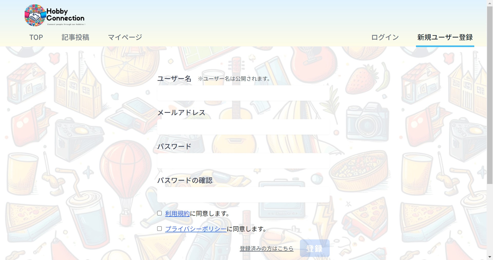</td>
        <td>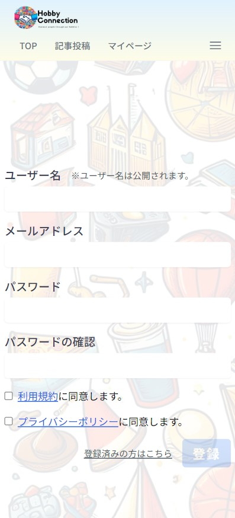</td>
    </tr>
    <tr>
        <td align="center">PC表示</td>
        <td align="center">スマートフォン表示</td>
    </tr>
    <tr>
        <td colspan="2">
            ユーザー名・メールアドレス・パスワードを入力してユーザー登録を行います。このとき、利用規約・プライバシーポリシーに同意する必要があります。
        </td>
    </tr>
</table>

<table>
    <tr>
        <th colspan="2" style="text-align:center;">ログイン画面</th>
    </tr>
    <tr>
        <td>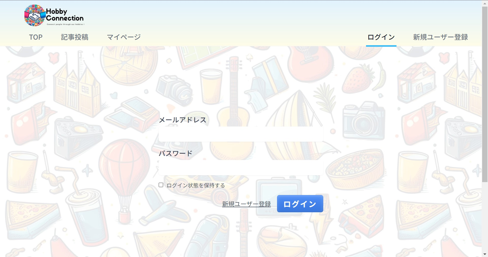</td>
        <td>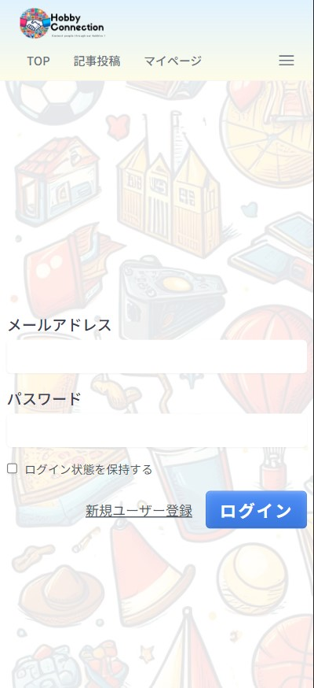</td>
    </tr>
    <tr>
        <td align="center">PC表示</td>
        <td align="center">スマートフォン表示</td>
    </tr>
    <tr>
        <td colspan="2">
            メールアドレス・パスワードを入力してログインを行います。
        </td>
    </tr>
</table>

<table>
    <tr>
        <th colspan="2" style="text-align:center;">投稿された全ての記事の一覧</th>
    </tr>
    <tr>
        <td></td>
        <td>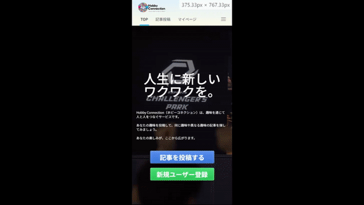</td>
    </tr>
    <tr>
        <td align="center">PC表示</td>
        <td align="center">スマートフォン表示</td>
    </tr>
    <tr>
        <td colspan="2">
            投稿された全ての記事を一覧表示します。ページネーション機能により、ページを移動することが出来ます。
        </td>
    </tr>
</table>

<table>
    <tr>
        <th colspan="2" style="text-align:center;">記事閲覧画面</th>
    </tr>
    <tr>
        <td></td>
        <td></td>
    </tr>
    <tr>
        <td align="center">PC表示</td>
        <td align="center">スマートフォン表示</td>
    </tr>
    <tr>
        <td colspan="2">
            投稿された記事を読むことができます。記事の内容に URL が含まれている場合、自動でリンクがつきます。
        </td>
    </tr>
</table>

<table>
    <tr>
        <th colspan="2" style="text-align:center;">記事投稿画面</th>
    </tr>
    <tr>
        <td></td>
        <td>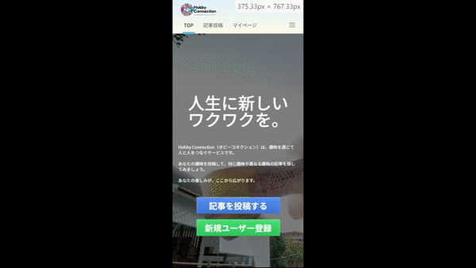</td>
    </tr>
    <tr>
        <td align="center">PC表示</td>
        <td align="center">スマートフォン表示</td>
    </tr>
    <tr>
        <td colspan="2">
            記事を投稿することができます。この画面では、以下の機能を実装しました。
            <ul>
                <li>アラート付きタイマー</li>
                <li>記事TOPのタイトル・期間・画像・概要・タグを設定する機能</li>
                <li>画像のプレビュー</li>
                <li>画像以外のファイル添付を防ぐ機能</li>
                <li>投稿の見出し・コメント・画像を設定する機能</li>
                <li>投稿の追加・削除</li>
                <li>ページ遷移・再読み込みによる入力内容が削除されるのを防ぐ機能</li>
                <li>記事投稿前確認アラート</li>
                <li>記事投稿中のロードアニメーション</li>
                <li>記事投稿完了アラート</li>
            </ul>
        </td>
    </tr>
</table>

<!-- 記事投稿画面の機能一覧 -->
<table>
    <tr>
        <th colspan="3" style="text-align:center;">記事投稿画面の機能</th>
    </tr>
    <tr>
        <td>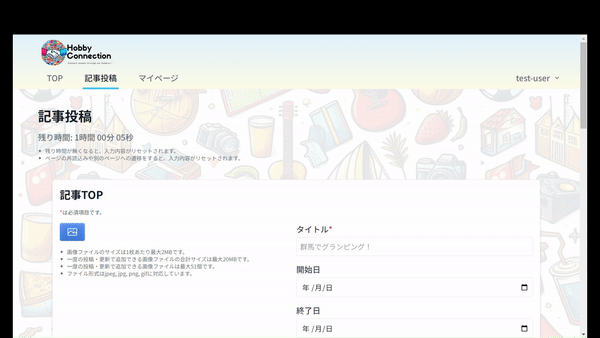</td>
        <td>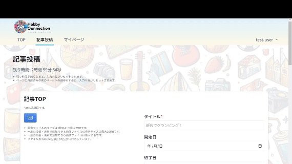</td>
        <td>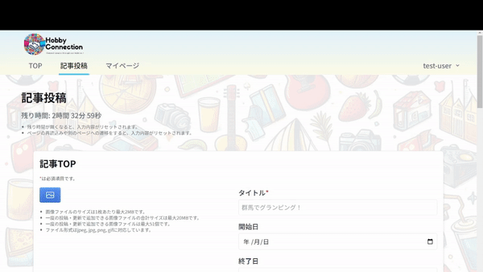</td>
    </tr>
    <tr>
        <td align="center">アラート付きタイマー</td>
        <td align="center">画像のプレビュー</td>
        <td align="center">画像以外のファイル添付を防ぐ機能</td>
    </tr>
    <!-- 二重線を引く -->
    <tr>
        <td colspan="3">
</td>
    </tr>
    <tr>
        <td>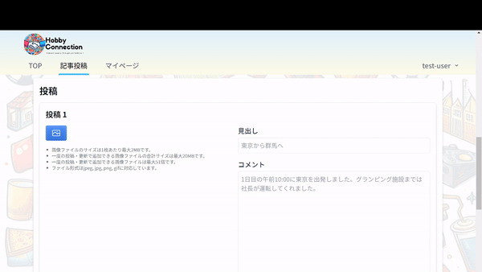</td>
        <td>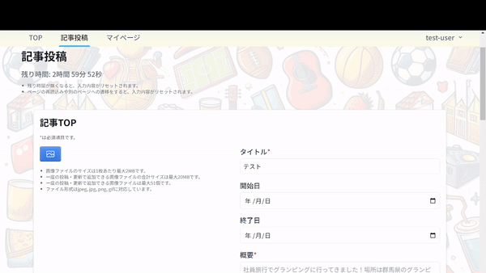</td>
        <td></td>
    </tr>
    <tr>
        <td align="center">投稿の追加・削除</td>
        <td align="center">ページ遷移・再読み込みによる入力内容が削除されるのを防ぐ機能</td>
        <td align="center">記事投稿前確認・投稿中のロードアニメーション・記事投稿完了アラート</td>
    </tr>
</table>

<!-- マイページ -->
<table>
    <tr>
        <th colspan="2" style="text-align:center;">マイページ</th>
    </tr>
    <tr>
        <td>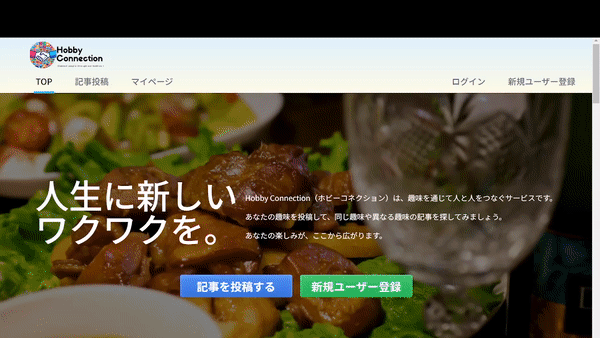</td>
        <td>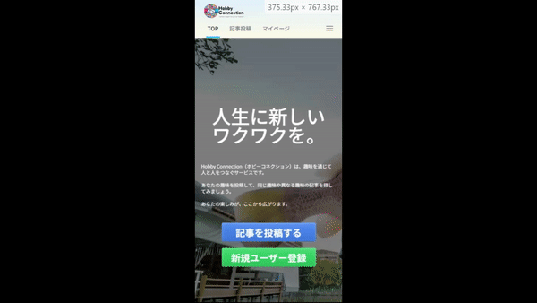</td>
    </tr>
    <tr>
        <td align="center">PC表示</td>
        <td align="center">スマートフォン表示</td>
    </tr>
    <tr>
        <td colspan="2">
            ユーザーのユーザー情報・投稿した記事を閲覧することができます。
        </td>
    </tr>
</table>

<!-- 投稿した記事の一覧 -->
<table>
    <tr>
        <th colspan="3" style="text-align:center;">投稿した記事の一覧</th>
    </tr>
    <tr>
        <td>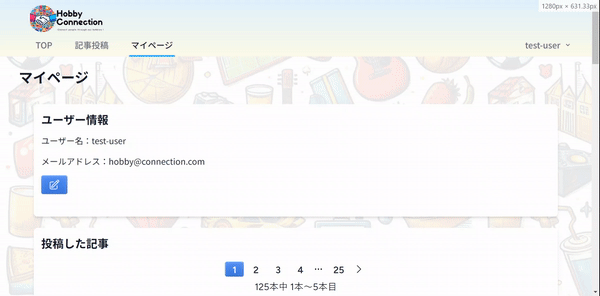</td>
        <td>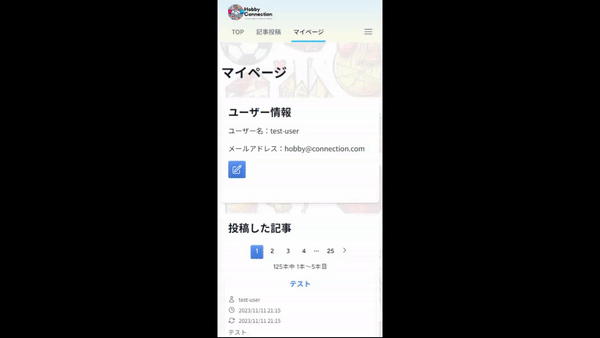</td>
        <td>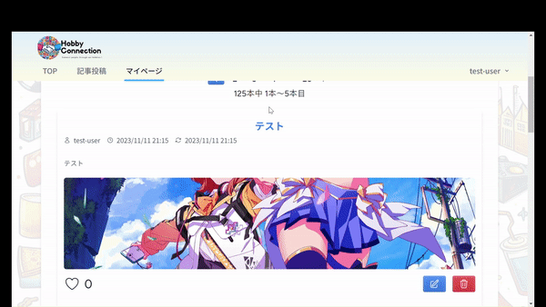</td>
    </tr>
    <tr>
        <td align="center">PC表示</td>
        <td align="center">スマートフォン表示</td>
        <td align="center">投稿した記事の削除</td>
    </tr>
    <tr>
        <td colspan="2">
            投稿した記事を一覧表示します。ページネーション機能により、ページを移動することが出来ます。記事編集・削除もこの画面から行うことが出来ます。
        </td>
    </tr>
</table>

<!-- 記事編集画面 -->
<table>
    <tr>
        <th colspan="2" style="text-align:center;">記事編集画面</th>
    </tr>
    <tr>
        <td></td>
        <td></td>
    </tr>
    <tr>
        <td align="center">PC表示</td>
        <td align="center">スマートフォン表示</td>
    </tr>
    <tr>
        <td colspan="2">
            投稿した記事を編集することができます。この画面では記事投稿画面と同様に、以下の機能を実装しました。
            <ul>
                <li>アラート付きタイマー</li>
                <li>記事TOPのタイトル・期間・画像
                <li>画像のプレビュー</li>
                <li>画像以外のファイル添付を防ぐ機能</li>
                <li>投稿の見出し・コメント・画像を設定する機能</li>
                <li>投稿の追加・削除</li>
                <li>ページ遷移・再読み込みによる入力内容が削除されるのを防ぐ機能</li>
                <li>記事更新前確認アラート</li>
                <li>記事更新中のロードアニメーション</li>
                <li>記事更新完了アラート</li>
            </ul>
        </td>
    </tr>
</table>

<!-- ユーザー情報編集画面 -->
<table>
    <tr>
        <th colspan="2" style="text-align:center;">ユーザー情報編集画面</th>
    </tr>
    <tr>
        <td></td>
        <td>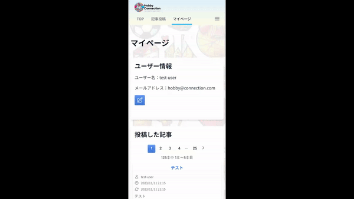</td>
    </tr>
    <tr>
        <td align="center">PC表示</td>
        <td align="center">スマートフォン表示</td>
    </tr>
    <tr>
        <td colspan="2">
            ユーザー情報・パスワードの編集とアカウントの削除をすることができます。
        </td>
    </tr>
</table>

### 今後搭載予定の機能

-   記事の一時保存機能
-   ユーザフォロー機能
-   投稿前に記事をプレビューする機能
-   閲覧した記事にコメントする機能
-   記事検索機能
-   ユーザ検索機能
-   検索したユーザのユーザー情報・記事を閲覧できる機能（タグをクリックすると、そのタグを設定した記事が一覧表示されるようにする）

## ER 図

## 苦労した点

-

## 今後の改善案

-   コンポーネントや関数のメモ化を試みたが、ナビゲーションバーしか上手くいかなかった。具体的には、以下の点が上手くいかなかった。

    -   サブフォームがレンダリングされると親コンポーネントのメインフォームとページ（create.tsx、edit.tsx）が再レンダリングされてしまう。
    -   メインフォームが入力されると子コンポーネントのサブフォームと親コンポーネントのページ（create.tsx、edit.tsx）が再レンダリングされてしまう。しかし、サブフォームをメモ化するとサブフォームをループでレンダリングするメインフォームがレンダリングされないので、サブフォームで入力・削除するとそのサブフォーム以降のサブフォームが消滅する。
    -   React Dev Tools の Profiler でパフォーマンスを計測しようとしたが、「Profiling not supported. Profiling support requires either a development or profiling build of React v16.5+.」と表示され、使用できない。開発環境の React は v18.2.0 であり、条件を満たしているのにも関わらず、サポート対象外となってしまう。

    序盤からメモ化することを想定してコンポーネントを設計しないとパフォーマンス改善に取り組むことすら出来なくなるのだと学んだ。特に、状態管理ライブラリとして Redux や Recoil を採用すれば、パフォーマンス改善の余地があったのかもしれない。今後はこのようなことがないように、他のエンジニアにコードレビューをしてもらいながら開発するようにしたい。
