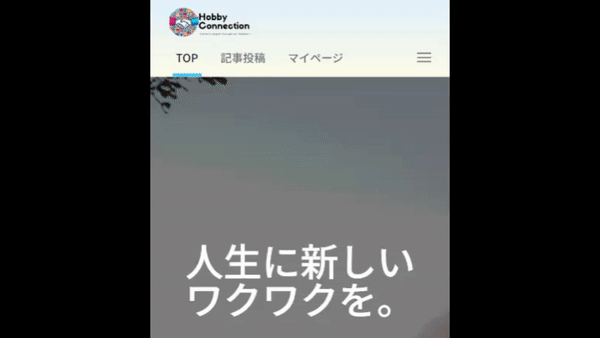

# Hobby Connection

## 企業様へ

このアプリは「記事投稿・編集機能」に最も力を入れて開発しました。このアプリを評価する際は是非、**テスト用環境にて、実際に記事の投稿と編集をご体験ください。**

## 本番環境

https://hobby-connection-546e3e86ca25.herokuapp.com

## テスト用環境

https://hobby-connection-test-500d4e31fbe0.herokuapp.com

テストユーザーを自由にご利用いただけます。ただし、運用中の本番環境との競合を避けるため、テスト用環境のみでご使用ください。

### テストユーザー情報

| 項目           | 情報                 |
| -------------- | -------------------- |
| ユーザー名     | test-user            |
| メールアドレス | hobby@connection.com |
| パスワード     | hobbyconnectiontest  |

## Hobby Connection とは

自分の趣味をみんなに共有するブログアプリです。

本アプリは共通の趣味を持ったユーザ同士で盛り上がったり、新しい趣味を見つけられるようにすることで人生をより楽しくすること目指しています。

特に、記事を投稿したユーザ自身に興味を持ち、そのユーザの別の趣味に触れることで、新たな趣味をつくるというプロセスを作りたいです。

## 開発背景

開発しようと思った理由は以下の３つです。

1. 実際に趣味を体験できない人でも体験した気分を味わえるようなものを作ってみたいと思ったから
2. 楽しい体験を伝えることで人を楽しませるものを作ってみたいと思ったから
3. 今まで触れてこなかった趣味を体験することで、プラスの感情を作ってみたいと思ったから

以下でそれぞれの理由について説明します。

#### 1. 実際に趣味を体験できない人でも体験した気分を味わえるようなものを作ってみたいと思ったから

私は Vtuber が好きで、以前この動画([https://www.youtube.com/watch?v=iA8zNXWO2iI](https://www.youtube.com/watch?v=iA8zNXWO2iI))を観ていた際に、一度くらい自分のお金で旅行に行ってみたいと思いました。しかし、私には旅行に行けるほどのお金や時間はありません。その時にふと私は、私以外にもお金や時間がない人や、怪我や病気等で行くことが出来ない人もいると気付きました。つまり、趣味を体験したくても体験できないという人がこの世界には沢山いると気付いたのです。そこで、そういった人達が趣味を体験した気分を味わえるようなものがあれば良いと思いました。

#### 2. 楽しい体験を伝えることで人を楽しませるものを作ってみたいと思ったから

先程の動画を観たことで、楽しい体験を伝えることで人を楽しませるものを作ってみたいと思いました。私は実際にその場にいませんでしたが、移動中の雑談や、グランピング、トランプを楽しんでいる様子を観ていて、楽しいと感じました。これにより、私は実際に体験できなくてもその場の楽しさを伝えることが出来ると実感し、体験の楽しさを伝えるものを作ってみたいと思いました。

#### 3. 今まで触れてこなかった趣味を体験することで、プラスの感情を作ってみたいと思ったから

先程の動画は、Vtuber というコンテンツを起点として、視聴者を旅行というコンテンツにつなげるものだと考えております。また、私は新たな趣味を見つけると、人生が豊かになると考えています。例えば、私は Vtuber というコンテンツに初めて触れたとき、「かわいい」「面白い」「一緒にいて楽しい」といった感情が湧き上がって幸せになりました。ご自身の経験に照らし合わせて想像して下さい。新たな趣味を見つけたときの気持ちはどのようなものでしたか？「楽しい」「面白い」「好き」等プラスの感情が湧き上がってきませんでしたか？私は先程の動画を見て、このような感情を作ってみたいと思いました。

以上の理由から、私は趣味を共有できる Web アプリを作ってみたいと思いました。Hobby Connection を使用することで、趣味を体験して楽しみ、新たな趣味を見つけて、人生が今よりも豊かになれば嬉しいです。

## 機能一覧

-   [レスポンシブデザイン](#レスポンシブデザイン)
-   [ナビゲーションバー](#ナビゲーションバー)
    -   [ログイン前](#ログイン前)
        -   [PC 表示](#ログイン前-pc)
        -   [スマートフォン表示](#ログイン前-スマートフォン)
    -   [ログイン後](#ログイン後)
        -   [PC 表示](#ログイン後-pc)
        -   [スマートフォン表示](#ログイン後-スマートフォン)
-   [TOP 画面](#top-画面)
    -   [アプリ紹介画面](#アプリ紹介画面)
        -   [PC 表示](#アプリ紹介画面-pc)
        -   [スマートフォン表示](#アプリ紹介画面-スマートフォン)
    -   [投稿された全ての記事の一覧](#投稿された全ての記事の一覧)
        -   [PC 表示](#投稿された全ての記事の一覧-pc)
        -   [スマートフォン表示](#投稿された全ての記事の一覧-スマートフォン)
-   [ログイン画面](#ログイン画面)
    -   [PC 表示](#ログイン画面-pc)
    -   [スマートフォン表示](#ログイン画面-スマートフォン)
-   [新規登録画面](#新規登録画面)
    -   [PC 表示](#新規登録画面-pc)
    -   [スマートフォン表示](#新規登録画面-スマートフォン)
-   [記事閲覧画面](#記事閲覧画面)
    -   [PC 表示](#記事閲覧画面-pc)
    -   [スマートフォン表示](#記事閲覧画面-スマートフォン)
-   [記事投稿画面](#記事投稿画面)
    -   [PC 表示](#記事投稿画面-pc)
    -   [スマートフォン表示](#記事投稿画面-スマートフォン)
    -   [記事投稿画面の機能](#記事投稿画面の機能)
        -   [アラート付きタイマー](#アラート付きタイマー)
        -   [画像のプレビュー](#画像のプレビュー)
        -   [画像以外のファイル添付を防ぐ機能](#画像以外のファイル添付を防ぐ機能)
        -   [投稿の追加・削除](#投稿の追加・削除)
        -   [ページ遷移・再読み込みによる入力内容が削除されるのを防ぐ機能](#ページ遷移・再読み込みによる入力内容が削除されるのを防ぐ機能)
        -   [記事投稿前確認・投稿中のロードアニメーション・記事投稿完了アラート](#記事投稿前確認・投稿中のロードアニメーション・記事投稿完了アラート)
        -   [タイトル・概要が未入力の際のエラーメッセージ](#タイトル・概要が未入力の際のエラーメッセージ)
        -   [画像サイズが 2MB を超過した際のエラーメッセージ](#画像サイズが-2mb-を超過した際のエラーメッセージ)
        -   [画像合計サイズが 20MB を超過した際のエラーメッセージ](#画像合計サイズが-20mb-を超過した際のエラーメッセージ)
-   [マイページ](#マイページ)
    -   [PC 表示](#マイページ-pc)
    -   [スマートフォン表示](#マイページ-スマートフォン)
    -   [投稿した記事の削除](#投稿した記事の削除)
-   [記事編集画面](#記事編集画面)
    -   [PC 表示](#記事編集画面-pc)
    -   [スマートフォン表示](#記事編集画面-スマートフォン)
-   [ユーザー情報編集画面](#ユーザー情報編集画面)
    -   [PC 表示](#ユーザー情報編集画面-pc)
    -   [スマートフォン表示](#ユーザー情報編集画面-スマートフォン)
-   [いいね機能](#いいね機能)
    -   [ログイン前](#いいね機能-ログイン前)
    -   [ログイン後](#いいね機能-ログイン後)

<!-- レスポンシブデザイン -->
<table>
    <tr>
        <th id="レスポンシブデザイン" colspan="2" style="text-align:center;">レスポンシブデザイン</th>
    </tr>
    <tr>
        <td colspan="2">
            PCとスマートフォンの両方で表示できるようにレスポンシブデザインを実装しました。以降では、PCとスマートフォンでの表示例を示します。
        </td>
    </tr>
</table>

<!-- ナビゲーションバー -->
<table>
    <tr>
        <th id="ナビゲーションバー" colspan="2" style="text-align:center;">ナビゲーションバー</th>
    </tr>
    <tr>
        <td colspan="2">
            ログイン前とログイン後で表示が変わります。ログイン前は、ログイン画面・新規登録画面のリンクが表示されます。ログイン後は、ユーザー情報編集・マイページ・ログアウトのリンクが表示されます。画面を下にスクロールすると、ナビゲーションバーのロゴ部分が画面上部に折りたたまれます。逆に、画面を上にスクロールすると、ナビゲーションバーのロゴ部分が画面上部から出てきます。
        </td>
    </tr>
    <!-- ログイン前 -->
    <tr>
        <th id="ログイン前" colspan="2" style="text-align:center;">ログイン前</th>
    </tr>
    <tr>
        <td id="ログイン前-pc"></td>
        <td id="ログイン前-スマートフォン"></td>
    </tr>
    <tr>
        <td align="center">PC表示</td>
        <td align="center">スマートフォン表示</td>
    </tr>
    <!-- ログイン後 -->
    <tr>
        <th id="ログイン後" colspan="2" style="text-align:center;">ログイン後</th>
    </tr>
    <tr>
        <td id="ログイン後-pc"></td>
        <td id="ログイン後-スマートフォン"></td>
    </tr>
    <tr>
        <td align="center">PC表示</td>
        <td align="center">スマートフォン表示</td>
    </tr>
</table>

<!-- TOP画面 -->
<table>
    <tr>
        <th id="top-画面" colspan="2" style="text-align:center;">TOP画面</th>
    </tr>
    <tr>
        <td colspan="2">
            アプリ紹介画面と投稿された全ての記事の一覧を表示します。ナビゲーションバーのロゴ部分をクリックすると、TOP画面に遷移します。
        </td>
    </tr>
    <!-- アプリ紹介画面 -->
    <tr>
        <th id="アプリ紹介画面" colspan="2" style="text-align:center;">アプリ紹介画面</th>
    </tr>
        <tr>
        <td colspan="2">
            サービス内容が一目で分かるように実装しました。
        </td>
    </tr>
    <tr>
        <td id="アプリ紹介画面-pc"></td>
        <td id="アプリ紹介画面-スマートフォン"></td>
    </tr>
    <tr>
        <td align="center">PC表示</td>
        <td align="center">スマートフォン表示</td>
    </tr>
    <!-- 投稿された全ての記事の一覧 -->
    <tr>
        <th id="投稿された全ての記事の一覧" colspan="2" style="text-align:center;">投稿された全ての記事の一覧</th>
    </tr>
        <tr>
        <td colspan="2">
            投稿された全ての記事を一覧表示します。ページネーション機能により、ページを移動することが出来ます。
        </td>
    </tr>
    <tr>
        <td id="投稿された全ての記事の一覧-pc"></td>
        <td id="投稿された全ての記事の一覧-スマートフォン"></td>
    </tr>
    <tr>
        <td align="center">PC表示</td>
        <td align="center">スマートフォン表示</td>
    </tr>
</table>

<!-- ログイン画面 -->
<table>
    <tr>
        <th id="ログイン画面" colspan="2" style="text-align:center;">ログイン画面</th>
    </tr>
        <tr>
        <td colspan="2">
            メールアドレス・パスワードを入力してログインを行います。
        </td>
    </tr>
    <tr>
        <td id="ログイン画面-pc"></td>
        <td id="ログイン画面-スマートフォン"></td>
    </tr>
    <tr>
        <td align="center">PC表示</td>
        <td align="center">スマートフォン表示</td>
    </tr>
</table>

<!-- 新規登録画面 -->
<table>
    <tr>
        <th id="新規登録画面" colspan="2" style="text-align:center;">新規登録画面</th>
    </tr>
        <tr>
        <td colspan="2">
            ユーザー名・メールアドレス・パスワードを入力してユーザー登録を行います。このとき、利用規約・プライバシーポリシーに同意する必要があります。
        </td>
    </tr>
    <tr>
        <td id="新規登録画面-pc"></td>
        <td id="新規登録画面-スマートフォン"></td>
    </tr>
    <tr>
        <td align="center">PC表示</td>
        <td align="center">スマートフォン表示</td>
    </tr>
</table>

<!-- 記事閲覧画面 -->
<table>
    <tr>
        <th id="記事閲覧画面" colspan="2" style="text-align:center;">記事閲覧画面</th>
    </tr>
        <tr>
        <td colspan="2">
            投稿された記事を読むことができます。記事の内容に URL が含まれている場合、自動でリンクがつきます。ログイン状態に関わらず、記事を閲覧できます。
        </td>
    </tr>
    <tr>
        <td id="記事閲覧画面-pc"></td>
        <td id="記事閲覧画面-スマートフォン"></td>
    </tr>
    <tr>
        <td align="center">PC表示</td>
        <td align="center">スマートフォン表示</td>
    </tr>
</table>

<!-- 記事投稿画面 -->
<table>
    <tr>
        <th id="記事投稿画面" colspan="6" style="text-align:center;">記事投稿画面</th>
    </tr>
    <tr>
        <td colspan="6">
            記事を投稿することができます。この画面では、以下の機能を実装しました。
            <ul>
                <li>アラート付きタイマー</li>
                <li>記事TOPのタイトル・期間・画像・概要・タグを設定する機能</li>
                <li>画像のプレビュー</li>
                <li>画像以外のファイル添付を防ぐ機能</li>
                <li>投稿の見出し・コメント・画像を設定する機能</li>
                <li>投稿の追加・削除</li>
                <li>ページ遷移・再読み込みによる入力内容が削除されるのを防ぐ機能</li>
                <li>記事投稿前確認アラート</li>
                <li>バリデーション機能（タイトル・概要が未入力、画像サイズ超過、画像合計サイズ超過、画像合計数超過）</li>
                <li>記事投稿中のロードアニメーション</li>
                <li>記事投稿完了アラート</li>
            </ul>
        </td>
    </tr>
    <tr>
        <td id="記事投稿画面-pc" colspan="3"></td>
        <td id="記事投稿画面-スマートフォン" colspan="3"></td>
    </tr>
    <tr>
        <td colspan="3" align="center">PC表示</td>
        <td colspan="3" align="center">スマートフォン表示</td>
    </tr>
    <!-- 記事投稿画面の機能一覧 -->
    <tr>
        <th colspan="6" style="text-align:center;">記事投稿画面の機能一覧</th>
    </tr>
    <tr>
        <td id="アラート付きタイマー" colspan="2"></td>
        <td id="画像のプレビュー" colspan="2"></td>
        <td id="画像以外のファイル添付を防ぐ機能" colspan="2"></td>
    </tr>
    <tr>
        <td colspan="2" align="center">アラート付きタイマー</td>
        <td colspan="2" align="center">画像のプレビュー</td>
        <td colspan="2" align="center">画像以外のファイル添付を防ぐ機能</td>
    </tr>
    <tr>
        <td id="投稿の追加・削除" colspan="2"></td>
        <td id="ページ遷移・再読み込みによる入力内容が削除されるのを防ぐ機能" colspan="2"></td>
        <td id="記事投稿前確認・投稿中のロードアニメーション・記事投稿完了アラート" colspan="2"></td>
    </tr>
    <tr>
        <td colspan="2" align="center">投稿の追加・削除</td>
        <td colspan="2" align="center">ページ遷移・再読み込みによる入力内容が削除されるのを防ぐ機能</td>
        <td colspan="2" align="center">記事投稿前確認・投稿中のロードアニメーション・記事投稿完了アラート</td>
    </tr>
    <!-- バリデーション -->
    <tr>
        <td id="タイトル・概要が未入力の際のエラーメッセージ" colspan="2"></td>
        <td id="画像サイズが-2mb-を超過した際のエラーメッセージ" colspan="2"></td>
        <td id="画像合計サイズが-20mb-を超過した際のエラーメッセージ" colspan="2"></td>
    </tr>
    <tr>
        <td colspan="2" align="center">タイトル・概要が未入力の際のエラーメッセージ</td>
        <td colspan="2" align="center">画像サイズが 2MB を超過した際のエラーメッセージ</td>
        <td colspan="2" align="center">画像合計サイズが 20MB を超過した際のエラーメッセージ</td>
    </tr>
</table>

<!-- マイページ -->
<table>
    <tr>
        <th id="マイページ" colspan="3" style="text-align:center;">マイページ</th>
    </tr>
    <tr>
        <td colspan="3">
            ユーザーのユーザー情報・投稿した記事を閲覧することができます。ページネーション機能により、ページを移動することが出来ます。記事編集・削除もこの画面から行うことが出来ます。
        </td>
    </tr>
    <tr>
        <td id="マイページ-pc"></td>
        <td id="マイページ-スマートフォン"></td>
        <td id="投稿した記事の削除"></td>
    </tr>
    <tr>
        <td align="center">PC表示</td>
        <td align="center">スマートフォン表示</td>
        <td align="center">投稿した記事の削除</td>
    </tr>
</table>

<!-- 記事編集画面 -->
<table>
    <tr>
        <th id="記事編集画面" colspan="2" style="text-align:center;">記事編集画面</th>
    </tr>
    <tr>
        <td colspan="2">
            投稿した記事を編集することができます。この画面では記事投稿画面と同様に、以下の機能を実装しました。
            <ul>
                <li>アラート付きタイマー</li>
                <li>記事TOPのタイトル・期間・画像
                <li>画像のプレビュー</li>
                <li>画像以外のファイル添付を防ぐ機能</li>
                <li>投稿の見出し・コメント・画像を設定する機能</li>
                <li>投稿の追加・削除</li>
                <li>ページ遷移・再読み込みによる入力内容が削除されるのを防ぐ機能</li>
                <li>記事更新前確認アラート</li>
                <li>バリデーション機能</li>
                <li>記事更新中のロードアニメーション</li>
                <li>記事更新完了アラート</li>
            </ul>
        </td>
    </tr>
    <tr>
        <td id="記事編集画面-pc"></td>
        <td id="記事編集画面-スマートフォン"></td>
    </tr>
    <tr>
        <td align="center">PC表示</td>
        <td align="center">スマートフォン表示</td>
    </tr>
</table>

<!-- ユーザー情報編集画面 -->
<table>
    <tr>
        <th id="ユーザー情報編集画面" colspan="2" style="text-align:center;">ユーザー情報編集画面</th>
    </tr>
        <tr>
        <td colspan="2">
            ユーザー情報・パスワードの編集とアカウントの削除をすることができます。
        </td>
    </tr>
    <tr>
        <td id="ユーザー情報編集画面-pc"></td>
        <td id="ユーザー情報編集画面-スマートフォン"></td>
    </tr>
    <tr>
        <td align="center">PC表示</td>
        <td align="center">スマートフォン表示</td>
    </tr>
</table>

<!-- いいね機能 -->
<table>
    <tr>
        <th id="いいね機能" colspan="2" style="text-align:center;">いいね機能</th>
    </tr>
        <tr>
        <td colspan="2">
            記事一覧及び記事閲覧画面でいいねボタンが表示されます。ログイン前にいいねボタンを押すと、ログインを促すアラートが表示されます。ログイン後にいいねボタンを押すと、いいねが付きます。いいねを取り消すこともできます。
        </td>
    </tr>
    <tr>
        <td id="いいね機能-ログイン前"></td>
        <td id="いいね機能-ログイン後"></td>
    </tr>
    <tr>
        <td align="center">ログイン前</td>
        <td align="center">ログイン後</td>
    </tr>
</table>

## 開発人数

1 人

## 使用技術

| カテゴリ       | 使用技術                                                           |
| -------------- | ------------------------------------------------------------------ |
| 開発環境       | WSL2 (Ubuntu 22.04 LTS), Docker, Visual Studio Code, Git, GitHub   |
| 本番環境       | Heroku, Nginx                                                      |
| フロントエンド | TypeScript 5.0.2, React 18.2.0, Inertia.js 1.0, Tailwind CSS 3.2.1 |
| バックエンド   | PHP 8.2.10, Laravel 10.29.0, Inertia.js 1.0                        |
| データベース   | MySQL 8.0.32 (開発環境), Postgresql 15.4 (本番環境)                |
| インフラ       | Heroku, Amazon Web Services                                        |
| 認証           | Laravel Breeze (ユーザ認証), Laravel Sanctum (API認証)            |
| ファイル管理   | Amazon S3                                                          |

## システム構成図

## ER 図

## 工夫した点

-   ログイン状態によるアクセス制限

    -   ログインしていないと全く使えないサービスだと、ユーザーが気軽に使えないと考えたので、TOP ページと記事閲覧画面はログインしていなくても閲覧できるようにしました。

-   いいね機能

    -   いいね機能を実装することで、ユーザー同士の交流が発生し、いいねした方もされた方も嬉しくなると考えました。
    -   ユーザーがワクワクするような UI/UX にしたいと思い、いいねボタン押下時にボタンが飛び出して動くアニメーション実装しました。
    -   Laravel Sanctum を用いることで、API によるいいね状態やいいね数の取得・更新が可能です。また、Ajax 通信をしており、いいねボタン押下時に再読み込みが発生しないようにしました。

-   投稿・編集時の事故・不正防止機能

    -   投稿・編集時に、ユーザーが意図しない操作をしてしまうと、投稿・編集した内容が削除されてしまったり、不正なデータが投稿・編集されてしまう可能性があると考えました。そこで、以下の機能を実装しました。
        -   アラート付きタイマー
        -   ページ遷移・再読み込みによる入力内容が削除されるのを防ぐ機能
        -   投稿・画像の削除時に、削除するか確認するアラート
        -   記事投稿・更新前確認アラート
        -   バリデーション機能
    -   アラート付きタイマー
        -   セッションタイムアウトしてしまうと、投稿・編集した内容が削除されてしまいます。そこで、残り時間を表示することで、ユーザーがセッションタイムアウトを意識するようにしました。
        -   JavaScript の setInterval()は精度が悪く正確な時間を刻めないので、スタートしてからの経過時間（秒）を取得してそれを setTimeout()を使って再帰的に表示する方式にしました。
    -   ページ遷移・再読み込みによる入力内容が削除されるのを防ぐ機能
        -   ページ遷移・再読み込みによって、投稿・編集した内容が削除されてしまいます。そこで、ページ遷移・再読み込みをした際に、確認を促すアラートを表示することで、ユーザーに内容が削除されることを知らせるようにしました。
    -   投稿・画像の削除時に、削除するか確認するアラート
        -   ユーザーの意図しない投稿・画像の削除を防ぎます。
    -   記事投稿・更新前確認アラート
        -   ユーザーの意図しない投稿・更新を防ぐだけでなく、投稿・編集した内容が利用規約に違反していないかを確認させる効果もあります。
    -   バリデーション機能
        -   記事として最低限の情報が入力されているかを確認します。
        -   php.ini の post_max_size や upload_max_filesize、 max_file_uploads 等の値が超過するようなリクエストが送信されるのを防ぎます。

-   シンプルかつ直感的な UI

    -   このサービスは幅広い年齢層を対象としているためユーザービリティを考慮し、シンプルかつ直感的な UI になるようにデザインしました。
    -   具体的には、多くのサービスで一般的に見られるナビゲーションバーや、シンプルなアイコン、リンク部分にカーソルを合わせると色が変わるようにデザインしました。

-   レスポンシブデザイン

    -   誰でも手軽に使えることを意識しており、PC を普段使用しないユーザーも少なくないと考え、PC とスマートフォンの両方で使えるようにレスポンシブデザインを実装しました。

## 今後の展望

-   記事の一時保存機能の実装
    -   記事をセッション時間内に作成するのが難しいという意見があったため、記事を一次保存できるようにすることで、記事を途中まで作成して、後から編集することができるようにしたいと考えています。
-   ユーザーフォロー機能と記事にコメントする機能の実装
    -   「記事を投稿したユーザ自身に興味を持ち、そのユーザの別の趣味に触れることで、新たな趣味をつくるというプロセス」をつくるために、ユーザー同士のコミュニケーションを促すと考えられる、ユーザーフォロー機能と記事にコメントする機能を実装したいと考えています。
-   CI の導入
    -   heroku で CD を行っているが、heroku CI は有料であるため解析やビルド、テストを行えませんでした。今後は、別の方法で CI を導入したいと考えています。
-   コンポーネント設計の見直し
    -   コンポーネントの設計が不十分であるため、メモ化をしてもサブフォームがレンダリングされると親コンポーネントのメインフォームとページ（create.tsx、edit.tsx）が再レンダリングされてしまいます。メモ化することを想定してコンポーネントを設計し、状態管理ライブラリの Redux や Recoil を採用する必要があると思います。

### 今後搭載予定の機能

-   記事の一時保存機能
-   ユーザーフォロー機能
-   投稿前に記事をプレビューする機能
-   記事にコメントする機能
-   記事検索機能
-   ユーザ検索機能
-   検索したユーザのユーザー情報・記事を閲覧できる機能（タグをクリックすると、そのタグを設定した記事が一覧表示されるようにする）
